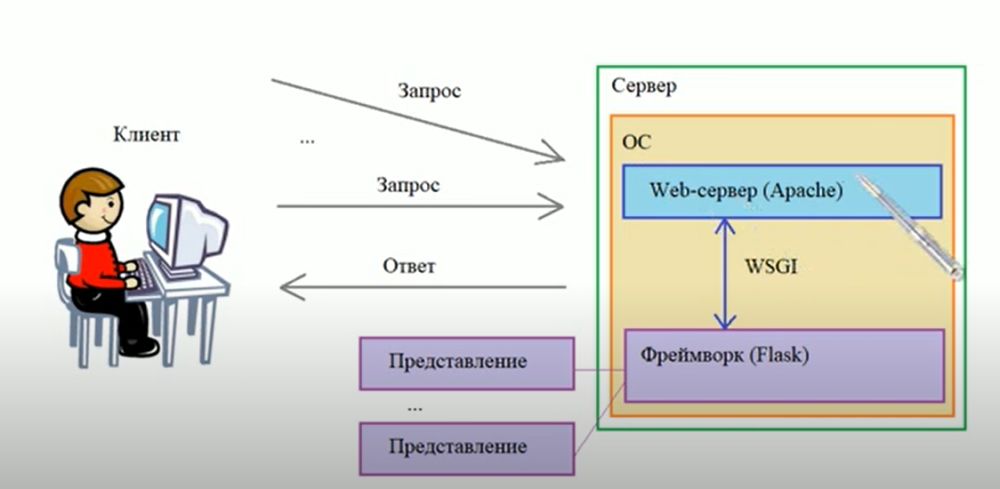

# fastaip_mongodb_project

# Начало работы

Для разработки мы будем использовать Fast API (Python).

Рассмотрим фреймворки подробнее.

## Фреймворк FAST API

<aside>
🔥 Документация: [https://fastapi.tiangolo.com/](https://fastapi.tiangolo.com/)

</aside>

### Что это?

[FastAPI](https://fastapi.tiangolo.com/) — это фреймворк для создания лаконичных и довольно быстрых HTTP API-серверов со встроенными валидацией, сериализацией и асинхронностью, что называется, из коробки. Стоит он на плечах двух других фреймворков: работой с web в FastAPI занимается [Starlette](https://www.starlette.io/), а за валидацию отвечает [Pydantic](https://pydantic-docs.helpmanual.io/).

Для работы FastAPI необходим ASGI-сервер, по дефолту документация предлагает uvicorn, базирующийся на uvloop.

### Что такое ASGI-сервер?

Сначала рассмотрим как работает сервер.  Ниже схема взаимодействия сервера с клиентом. 

 В нашем случае он состоит из Web-сервера, это uvicorn(на картинке Apache), который ждет поступление запросов, и фреймворка Fast api - это обработчик этих запросов. 

Также на картинке есть объекты "Представление" - это python функции, которые еще называют endpoint, о них поговорим позже. 

Данная картинка взята из этого [видео](https://www.youtube.com/watch?v=6jxveKOdyNg), будет **очень полезно** его посмотреть, хоть оно и для Flask.




На картинке указывается, что с помощью WSGI Web-сервер может взаимодействовать с фреймворком. Изучим, что такое WSGI.

> WSGI (англ. Web Server Gateway Interface) — стандарт взаимодействия между Python-программой, выполняющейся на стороне сервера, и самим веб-сервером, например Apache. Обработка запросов происходит многопоточно, для каждого запроса - свой поток.
> 

> ASGI (англ. Asynchronous Server Gateway Interface) — клиент-серверный протокол взаимодействия веб-сервера и приложения, дальнейшее развитие технологии WSGI. По сравнению с WSGI предоставляет стандарт как для асинхронных, так и для синхронных приложений, с реализацией обратной совместимости WSGI и несколькими серверами и платформами приложений.
> 

То есть ASGI отличается от WSGI отличается только принципом обработки запросом, в остальном они похожи. В целом для работы не особо важно понять что это, но принцип работы знать стоит. Подробнее можно прочитать [тут](https://habr.com/ru/post/482936/).

Надеюсь, теперь стано понятнее, как работает бэкенд. 

## Установка и разработка

<aside>
📌 [Туториал](https://testdriven.io/blog/fastapi-mongo/), который я переводила.

</aside>

### Установка и создание проекта

1. Для работы требуется [PyCharm](https://www.jetbrains.com/pycharm/). Скачайте его, если он еще не установлен.
2. Создайте новый проект Pure Python, проверьте, что интерпретатор выбран.


### Создадим дерево проекта

Создайте дерево папок как указано на картинке (server/models/car.py мы добавим позже):

```
├── app
│   ├── __init__.py
│   ├── main.py
│   └── server
│       ├── app.py
│       ├── database.py
│       ├── models
│       └── routes
└── requirements.txt
```


### Установка зависимостей

В файле requirements.txt запишите:

```markdown
fastapi==0.68.1
uvicorn==0.13.4
motor==2.5.1
python-decouple
```

Затем введите в терминал следующую команду: 

```
pip install -r requirements.txt
```

<aside>
📌 С помощью этой команды pip устанавливает зависимости проекта, которые записаны в файле requirements.txt в форме 'название пакета'=='версия'. Если вы не знаете версию,  укажите только название. Подробнее [тут](https://pip.pypa.io/en/stable/user_guide/).

</aside>

### Начнем писать приложение!

В файле app/server/app.py напишите:

```python
fromfastapiimport FastAPI

app = FastAPI()

@app.get("/", tags=["Root"])
asyncdef read_root():
return {"message": "Welcome to this fantastic app!"}
```

В файле  app/main.py запишите:

```python
import uvicorn

if __name__ == "__main__":
    uvicorn.run("server.app:app", host="127.0.0.1", port=8000, reload=True)
```

Что это значит?

Файл app/main.py будет нашей входной точкой - тем файлом, которое начинает выполняться при запуске сервера. Здесь в аргументе "server.app:app" мы запускаем файл для обработки запросов, которое расположено в файле /server/app с названием app.

Запустим наше первое приложение:

- Запуск через терминал в PyCharm
    
    ```bash
     python app/main.py
    ```
    
- Запуск через PyCharm
    1. Заходим в настройку конфигурации запуска.
    
    
    
    1. Укажите путь к файлу main, больше менять ничего не надо
    
    
    

При успешном запуске в консоле будет следующее:


Переходим по ссылке и видим JSON строку 


Ура! Все работает!

Перед тем, как начнем писать route и endpoints, составим схемы для бд.

### Схема БД

Давайте определим [схему](https://pydantic-docs.helpmanual.io/usage/schema/), которая будет основана на наших данных и будет определять, как данные будут храниться в MongoDB. 

Мы будем использовать Pydantic Schema для проверки данных наряду с сериализацией(преобразования данных) (JSON -> Python) и десериализацией (Python -> JSON). Но! он не служит валидатором схемы Mongo.

<aside>
⚠️ Документация Pydantic: [https://pydantic-docs.helpmanual.io/usage/schema/](https://pydantic-docs.helpmanual.io/usage/schema/)

</aside>

В папке app/server/models создадим файл car.py, здесь будет храниться схема наших данных.

```python
from typing import Optional

from pydantic import BaseModel, Field

class CarSchema(BaseModel):
    brand: str = Field(...)
    series: str = Field(...)
    color: str = Field(...)
    year_of_release: int = Field(...)

    class Config:
        schema_extra = {
            "example": {
                "brand": "BMW",
                "series": "M3",
                "color": "Blue",
                "year_of_release": "2016",
            }
        }

class UpdateCarModel(BaseModel):
    brand: Optional[str]
    series: Optional[str]
    color: Optional[str]
    year_of_release: Optional[int]

    class Config:
        schema_extra = {
            "example": {
                "brand": "BMW",
                "series": "M5",
                "color": "Yellow",
                "year_of_release": "2020",
            }
        }

def ResponseModel(data, message):
    return {
        "data": [data],
        "code": 200,
        "message": message,
    }

def ErrorResponseModel(error, code, message):
    return {"error": error, "code": code, "message": message}
```

CarSchema - модель, как будет представлен объект car в БД.

Рассмотрим синтаксис:

```python
brand: str = Field(...)
brand: str - задаем тип переменной, есть много типов переменных, они указаны в документации
Field(...) - многоточие указывает, что при создании объекта это поле обязательно нужно 
определить. 
```

class Config - позволяет настраивать поведение модели. В данном случае мы указываем пример заполнения полей модели. 

UpdateCarModel - класс для определения модели обновления объекта Car.  

Optional в строке color: Optional[str] означает, что поле не обязательно может быть определено. 

ResponseModel - модель, как будет представлен ответ на запрос, в нем указаны данные, код и сообщение.

ErrorResponseModel - соответственно, модель для запроса с ошибкой.

### Настроим Motor

Motor - это асинхронный драйвер MongoDB для взаимодействия с базой данных.

Его мы скачали, когда устанавливали зависимости.

В файл app/server/database.py добавьте код, где мы импортируем мотор, определяем, как мы подключаемся к БД. 

```python
import motor.motor_asyncio
from bson.objectid import ObjectId
from decouple import config

MONGO_DETAILS = "mongodb://localhost:27017"

client = motor.motor_asyncio.AsyncIOMotorClient(MONGO_DETAILS)

database = client.cars

car_collection = database.get_collection("car_collection")
```

Здесь создается client - объект драйвера для работы с БД. В database мы задаем название базы данных, а в car_collection создаем коллекцию, это аналог таблицы в реляционной БД.  При выполнении первой операции ввода-вывода будут созданы как база данных, так и коллекция, если они еще не существуют.

Теперь нужно создайть вспомогательную функцию для парсинка результата запроса к базе данных в словарь Python.

В том же файле ниже добавь:

```python
# Функция для преобразования данных из бд в словарь
def car_helper(car) -> dict:
    return {
        "id": str(car["_id"]),
        "brand": car["brand"],
        "series": car["series"],
        "color": car["color"],
        "year_of_release": car["year_of_release"]
    }
```

Теперь мы можем написать функции для взаимодействия с БД.

```python
# Получить все автомобили, присутствующие в базе данных
async def retrieve_cars():
    cars = []
    async for car in car_collection.find():
        cars.append(car_helper(car))
    return cars

# Добавить новый автомобиль в базу данных
async def add_car(car_data: dict) -> dict:
    car = await car_collection.insert_one(car_data)
    new_car = await car_collection.find_one({"_id": car.inserted_id})
    return car_helper(new_car)

# Получить автомобиль с соответствующим ID
async def retrieve_car(id: str) -> dict:
    car = await car_collection.find_one({"_id": ObjectId(id)})
    if car:
        return car_helper(car)

# Обновите автомобиль с помощью соответствующего ID
async def update_car(id: str, data: dict):
    # Возвращает значение false, если отправляется пустое тело запроса.
    if len(data) < 1:
        return False
    car = await car_collection.find_one({"_id": ObjectId(id)})
    if car:
        updated_car = await car_collection.update_one(
            {"_id": ObjectId(id)}, {"$set": data}
        )
        if updated_car:
            return True
        return False

# Удалить автомобиль из базы данных по ID
async def delete_car(id: str):
    car = await car_collection.find_one({"_id": ObjectId(id)})
    if car:
        await car_collection.delete_one({"_id": ObjectId(id)})
        return True
```

В приведенном выше коде мы определили асинхронные операции для создания, чтения, обновления и удаления данных авто в базе данных с помощью двигателя.

### Routers

Что такое Route?

Рассмотрим пример:

```
https://ru.hexlet.io/code_reviews/4172
https://ru.hexlet.io/courses/programming-basics
https://ru.hexlet.io/account/profile/edit
```

Каждый адрес из примера выше представляет собой конкретный маршрут (Route). Причём их можно разделить по типу: статические и динамические. Первый маршрут - динамический, т.к. id может меняться, остальные - статические.

В этом разделе мы добавим маршруты в дополнение к операциям с базой данных в файле базы данных.

В файле routes/car.py импортируем наши функции и модели и создадим роутер

```
from fastapi import APIRouter, Body
from fastapi.encoders import jsonable_encoder

from app.server.database import (
    add_car,
    delete_car,
    retrieve_car,
    retrieve_cars, update_car
)
from app.server.models.car import (
    ErrorResponseModel,
    ResponseModel,
    CarSchema,
    UpdateCarModel,
)

router = APIRouter()
```

Мы будем использовать JSON Compatible Encoder от FastAPI для преобразования наших моделей в формат, совместимый с JSON.

Затем подключите маршрутизатор в app/server/app.py:

```python
app.include_router(CarRouter, tags=["Car"], prefix="/car")
```

Таким образом файл app/server/app.py будет выглядет так:

```python
from fastapi import FastAPI

from app.server.routes.car import router as CarRouter

app = FastAPI()

app.include_router(CarRouter, tags=["Car"], prefix="/car")

@app.get("/", tags=["Root"])
async def read_root():
    return {"message": "Welcome to app!"}
```

### Подключение MongoDB Atlas

Создаем ссылку в Mongo Atlass. Чтобы не хардкодить ссылку(прописывать ее прямо в коде), заведем файл .env и положим ссылку туда. 


Переходим в файл app/server/database.py 

```python
Импортируем:
from decouple import config

Меняем строку 
MONGO_DETAILS = "mongodb://localhost:27017"
на
MONGO_DETAILS = config('MONGO_DETAILS') # read environment variable.
MONGO_DETAILS = MONGO_DETAILS
```

Мы подключились к БД и нам осталось перезагрузить веб-сервер, чтобы тестить запросы.

Вводим в терминал:

```python
uvicorn app.server.app:app --reload
```

Все! 

Запускаем наш сервер и переходим в Swagger по адресу [http://127.0.0.1:8000/docs](http://127.0.0.1:8000/docs).

Здесь наш фреймворк сам генерирует документацию к нашим эндпоитнам и позволяет отправлять им запросы. 

Если ты не знаешь о типах HTTP-запросов, то есть есть два самых часто используемых - GET, POST. Разница в том, что в POST есть тело запроса, он используется, например, для добавления данных в БД. В GET-запросе мы не может передать данные, то есть он работает как запрос на чтение данных, например, получить список объектов. 

Выбираем эндпоинт, чтобы добавить данные: 


Нажимаем Try it out и вводим данные, какие хотите, затем Execute. Если Code Response == 200, запрос выполнен успешно. 

Теперь проверим, что данные действительно записаны в БД.

Выберем эндпоинт, чтобы получить список машин:


Нажимаем Try it out и Execute.

Должно вернуться то, что вы только что положили в бд.

Если возникли проблемы, то напиши мне.


На этом с бэком все! Так мы выполнили задание 2.